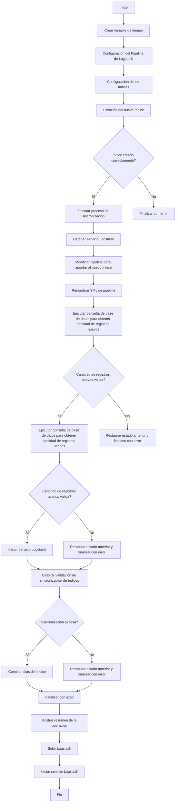

# mermaind-test-diagram

```mermaid
graph TD;
    A[Inicio] --> B[Crear variable de tiempo]
    B --> C[Configuración del Pipeline de Logstash]
    C --> D[Configuración de los índices]
    D --> E[Creación del nuevo índice]
    E --> F{Índice creado correctamente?}
    F -->|Sí| G[Ejecutar proceso de sincronización]
    F -->|No| H[Finalizar con error]
    G --> I[Detener servicio Logstash]
    I --> J[Modificar pipeline para apuntar al nuevo índice]
    J --> K[Renombrar YML de pipeline]
    K --> L[Ejecutar consulta de base de datos para obtener cantidad de registros nuevos]
    L --> M{Cantidad de registros nuevos válida?}
    M -->|Sí| N[Ejecutar consulta de base de datos para obtener cantidad de registros usados]
    M -->|No| O[Restaurar estado anterior y finalizar con error]
    N --> O1{Cantidad de registros usados válida?}
    O1 -->|Sí| P[Iniciar servicio Logstash]
    O1 -->|No| Q[Restaurar estado anterior y finalizar con error]
    P --> R[Ciclo de validación de sincronización de índices]
    Q --> R
    R --> S{Sincronización exitosa?}
    S -->|Sí| T[Cambiar alias del índice]
    S -->|No| U[Restaurar estado anterior y finalizar con error]
    T --> V[Finalizar con éxito]
    U --> V
    V --> W[Mostrar resumen de la operación]
    W --> X[Subir Logstash]
    X --> Y[Iniciar servicio Logstash]
    Y --> Z[Fin]
    
```
